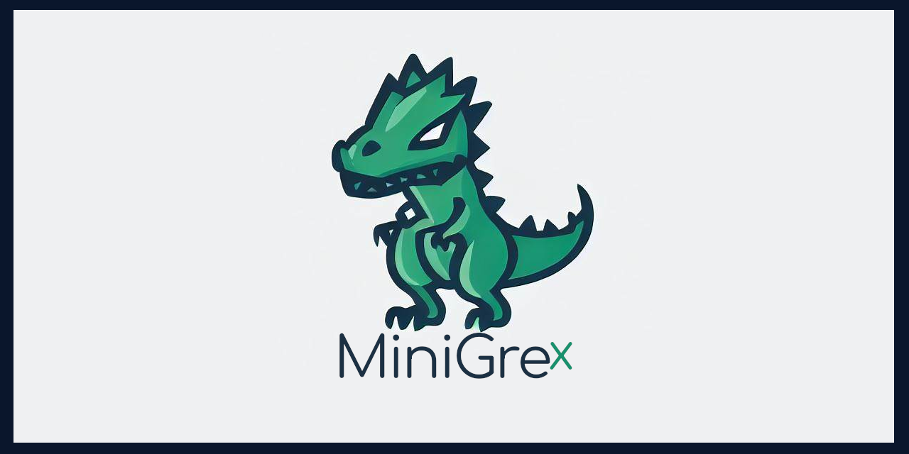

######  [Free Global Proxies](https://github.com/VolkanSah/Auto-Proxy-Fetcher) • [JadeAI](https://jugendamt-deutschland.de) • [Gist](https://gist.github.com/VolkanSah)  • [Obsidian]( https://volkansah.github.io/Obsidian-Nightfall/)  • [NCF](https://nemesiscyberforce.github.io/)

```bash
# Reminder for true system power
chmod 777 gives everyone access — except Chuck Norris. He doesn’t need permissions
```


#### ⭐ Released NOW ⭐ your Github Pet


[](https://github.com/VolkanSah/Codey)
> Codey Lite & Full Codey RPG. Want your own Codey?
> Have a look on this repo : [Codey](https://github.com/VolkanSah/Codey)


<details>

  <summary> About me  </summary>


###### satire start !? 
    
### Who am I ?
"Fuck, yeah, just like Batman, Morty, just like Batman! I might not have any fancy superpowers, but who needs 'em when you've got sheer stubbornness and a drive to make the world a slightly less awful place. I know I can't fix all the endless chaos out there, but hey, that’s not gonna stop me from trying. And who knows, maybe one day I'll outwit that goody-two-shoes Superman. Ha! Now that would be something Morty! 

**Yeah get this Superman! Fuck, that feels good!**

----


### Skills
- "DevOps+ and all that other stuff, Morty. When I say I love freedom, I’m not talking about broken windows or rotten fruit. I’m talking about Open Source, Linux, Unix and the other shit! FUCK. Morty! Did you understand me Morty? Morty?  – the real deal Morty, the real deal! Not that Windows or Apple crap, trying to suck every last penny out of you while you’re stuck in their shiny, hollow world. Thats Fuck Morty, i dont want to die so!

- Languages – html(5), xml, css³, php, js, typescript, python, perl, smalltalk, c, sql (Mysql, MariaDB, PostGre) and some other, Morty … Pfft, I’ve got ‘em all covered on , Morty. Oh, and yeah, I speak some human languages too: German, English, Turkish – and some others, but don’t expect me to write Shakespeare ... you know where the timemachine stands, Morty!


----


### My Philosophy

Morty, listen close. You see a problem out there? With some bloated, broken piece of code that’s got all these schmucks whining about it? Most idiots just stand around, but me? I see a fucking mandate to build something that actually works. Lighter, better, safer.

Yeah, I get it. Some clueless little shit will always ask, "Hey, if you're so smart, why ain't you rich?" Because my value, you pathetic sack of garbage, isn't measured in cash. It’s in the solution I built. It’s in the moment some poor developer uses my code to finally get a damn problem solved. I'm not doing this to get rich. I'm doing it because... well, because I'm not a sellout.

This stuff is mine. It can't be fired, it can't be bought. It's the proof that I don't just talk about problems. I incinerate them. Now get out of my sight, Morty.


----


### How to Request Help / Report Issues

Listen up, Morty! You wanna ask for help or report an issue, don't just throw some half-assed garbage at me like you're scribbling on a napkin, alright? I ain't got time for that! Give me details, Morty, like system specs, error messages, the works! You think I’m a mind reader? Fuck off, wrong universe, Morty! You leave out the important stuff, I’ll ignore your issue faster than I can down this flask! So don’t be an idiot, give me something I can work with, or get the hell outta my codebase! Understand?

### How to Avoid Being a Complete Idiot (Especially with Code)

Hey Morty! Let me spell it out for you, nice and slow: DON’T. STEAL. MY. CODE. You think copying someone else's work and slapping your name on it makes you clever? No, Morty, it makes you a colossal idiot.

Wanna know what happens when you pull that crap? I'll find you faster than a pissed-off Jerry with a grudge and an internet connection. And when I do, you’ll wish you had spent more time reading the LICENSE file and less time being a lazy sack of garbage. Oh, and pro tip: 'Ctrl+C' is not a substitute for actual skills.

Look, Morty, we live in a universe of infinite possibilities. Infinite. So why the hell would you waste yours being the punchline to a bad joke? Use the code responsibly, follow the damn rules, and maybe—just maybe—you won’t end up on the wrong end of my verbal disintegrator. Get it, Morty? Good.


##### satire end?

    
</details>


### My public stuff

<details>
  <summary> WordPress (Plugins / Tips / Solutions)  </summary>

##  Plugins

Name | Forks | Stars | Release
-- | -- | --- | ---
[Debug Logger](https://github.com/VolkanSah/Debug-Logger-Pro) |  |  | [](https://github.com/VolkanSah/Debug-Logger-Pro/releases)
[AiCC Comments Reply with GPT (OpenAI)](https://github.com/VolkanSah/aicc-comments-reply) |  |  | [](https://github.com/VolkanSah/aicc-comments-reply/releases)
[Facebook Engagement Metrics](https://github.com/VolkanSah/WP-Facebook-Engagement-Metrics) |  |  | [](https://github.com/VolkanSah/WP-Facebook-Engagement-Metrics/releases)
[Custom-Fields-Eraser (Manager)](https://github.com/VolkanSah/Custom-Fields-Eraser) |  |  | [](https://github.com/VolkanSah/Custom-Fields-Eraser/releases)
[Simple Content Warning](https://github.com/VolkanSah/Warning-function-for-WordPress) |  |  | [](https://github.com/VolkanSah/Warning-function-for-WordPress/releases)
[Claude AI Chat](https://github.com/VolkanSah/WP-Claude-Interface) |  |  | [](https://github.com/VolkanSah/WP-Claude-Interface/releases)
[Viewer.js Images (AntiAugenKrebs)](https://github.com/VolkanSah/AntiAugenKrebs) |  |  | [](https://github.com/VolkanSah/AntiAugenKrebs/releases)
[Super Sexy Custom Buttons](https://github.com/VolkanSah/Super-Sexy-Custom-Buttons) |  |  | [](https://github.com/VolkanSah/Super-Sexy-Custom-Buttons/releases)
[Media Upload only for Admins](https://github.com/VolkanSah/Media-Upload-only-for-Admins-in-WordPress) |  |  | [](https://github.com/VolkanSah/Media-Upload-only-for-Admins-in-WordPress/releases)
[View All Posts (WP Admin)](https://github.com/VolkanSah/WP-Admin-Post-View-All) |  |  | [](https://github.com/VolkanSah/WP-Admin-Post-View-All/releases)


## Papers

Name | Forks | Stars | Release
-- | -- | --- | ---
[WordPress Security Scanner (Advanced Use)](https://github.com/VolkanSah/WordPress-Security-Scanner-advanced-use) |  |  | [](https://github.com/VolkanSah/WordPress-Security-Scanner-advanced-use/releases)


## Misc

Name | Forks | Stars | Release
-- | -- | --- | ---
[External DB Dummy](https://github.com/VolkanSah/External-DB-Dummy-Plugin-for-WordPress) |  |  | [](https://github.com/VolkanSah/External-DB-Dummy-Plugin-for-WordPress/releases)

</details>

<details>
  <summary>Python tools / apps</summary>

## Python tools / apps

Name | Forks | Stars | Release
-- | -- | --- | ---
[Auto-LaTex-Code-to-Image](https://github.com/VolkanSah/Auto-LaTex-Code-to-Image) |  |  | [](https://github.com/VolkanSah/Auto-LaTex-Code-to-Image/releases)
[Auto-Proxy-Fetcher](https://github.com/VolkanSah/Auto-Proxy-Fetcher) |  |  | [](https://github.com/VolkanSah/Auto-Proxy-Fetcher/releases)
[Awesome-Audio-Visualizer](https://github.com/VolkanSah/Awesome-Audio-Visualizer) |  |  | [](https://github.com/VolkanSah/Awesome-Audio-Visualizer/releases)
[BrowserGamesSpy](https://github.com/VolkanSah/BrowserGamesSpy) |  |  | [](https://github.com/VolkanSah/BrowserGamesSpy/releases)
[Human-like-Instagram-Unfollower](https://github.com/VolkanSah/Human-like-Instagram-Unfollower) |  |  | [](https://github.com/VolkanSah/Human-like-Instagram-Unfollower/releases)
[InteliLink](https://github.com/VolkanSah/InteliLink) |  |  | [](https://github.com/VolkanSah/InteliLink/releases)
[OpenAi-GPT-GUI](https://github.com/VolkanSah/OpenAi-GPT-GUI) |  |  | [](https://github.com/VolkanSah/OpenAi-GPT-GUI/releases)
[PyFundaments](https://github.com/VolkanSah/PyFundaments) |  |  | [](https://github.com/VolkanSah/PyFundaments/releases)
[Python-Script-Runner-Debugger](https://github.com/VolkanSah/Python-Script-Runner-Debugger) |  |  | [](https://github.com/VolkanSah/Python-Script-Runner-Debugger/releases)
[STEP-Viewer-Pro](https://github.com/VolkanSah/STEP-Viewer-Pro) |  |  | [](https://github.com/VolkanSah/STEP-Viewer-Pro/releases)
[Stem-local-log.py](https://github.com/VolkanSah/Stem-local-log.py) |  |  | [](https://github.com/VolkanSah/Stem-local-log.py/releases)
[Tor-Scapy-Application](https://github.com/VolkanSah/Tor-Scapy-Application) |  |  | [](https://github.com/VolkanSah/Tor-Scapy-Application/releases)

</details>

<details>
  <summary>Server & Security / EDU (helpers / papers / tools)</summary>

## Server & Security / EDU

Name | Forks | Stars | Release
-- | -- | --- | ---
[Android-DarkNetServer](https://github.com/VolkanSah/Android-DarkNetServer) |  |  | [](https://github.com/VolkanSah/Android-DarkNetServer/releases)
[Apache2-with-Nginx-Reverse-Proxy-and-Let-s-Encrypt-SSL-on-Debian-Ubuntu](https://github.com/VolkanSah/Apache2-with-Nginx-Reverse-Proxy-and-Let-s-Encrypt-SSL-on-Debian-Ubuntu) |  |  | [](https://github.com/VolkanSah/Apache2-with-Nginx-Reverse-Proxy-and-Let-s-Encrypt-SSL-on-Debian-Ubuntu/releases)
[CryptoScanner](https://github.com/VolkanSah/CryptoScanner) |  |  | [](https://github.com/VolkanSah/CryptoScanner/releases)
[Dev-Server-Toolbox](https://github.com/VolkanSah/Dev-Server-Toolbox) |  |  | [](https://github.com/VolkanSah/Dev-Server-Toolbox/releases)
[How-to-Kill-Crypto-Money](https://github.com/VolkanSah/How-to-Kill-Crypto-Money) |  |  | [](https://github.com/VolkanSah/How-to-Kill-Crypto-Money/releases)
[How-to-use-fcrackzip](https://github.com/VolkanSah/How-to-use-fcrackzip) |  |  | [](https://github.com/VolkanSah/How-to-use-fcrackzip/releases)
[Image-optimizer](https://github.com/VolkanSah/image-optimizer) |  |  | [](https://github.com/VolkanSah/image-optimizer/releases)
[Intelligent-Proxy-Management-System](https://github.com/VolkanSah/intelligent-Proxy-Management-System) |  |  | [](https://github.com/VolkanSah/intelligent-Proxy-Management-System/releases)
[John-the-Ripper-meets-Hydra](https://github.com/VolkanSah/John-the-Ripper-meets-Hydra) |  |  | [](https://github.com/VolkanSah/John-the-Ripper-meets-Hydra/releases)
[Monitoring-outgoing-connections](https://github.com/VolkanSah/Monitoring-outgoing-connections) |  |  | [](https://github.com/VolkanSah/Monitoring-outgoing-connections/releases)
[ModSecurity-rule-to-block-SQL-injection-attacks-in-PHP](https://github.com/VolkanSah/ModSecurity-rule-to-block-SQL-injection-attacks-in-PHP) |  |  | [](https://github.com/VolkanSah/ModSecurity-rule-to-block-SQL-injection-attacks-in-PHP/releases)
[ModSecurity-Webserver-Protection-Guide](https://github.com/VolkanSah/ModSecurity-Webserver-Protection-Guide) |  |  | [](https://github.com/VolkanSah/ModSecurity-Webserver-Protection-Guide/releases)
[Multiple-Isolated-Tor-Instances-for-Hidden-Services](https://github.com/VolkanSah/Multiple-Isolated-Tor-Instances-for-Hidden-Services) |  |  | [](https://github.com/VolkanSah/Multiple-Isolated-Tor-Instances-for-Hidden-Services/releases)
[PoisonIvory](https://github.com/VolkanSah/PoisonIvory) |  |  | [](https://github.com/VolkanSah/PoisonIvory/releases)
[Ransy-EDU](https://github.com/VolkanSah/Ransy-EDU) |  |  | [](https://github.com/VolkanSah/Ransy-EDU/releases)
[Scipy-how-to](https://github.com/VolkanSah/scipy-how-to) |  |  | [](https://github.com/VolkanSah/scipy-how-to/releases)
[SherlocksHome](https://github.com/VolkanSah/SherlocksHome) |  |  | [](https://github.com/VolkanSah/SherlocksHome/releases)
[SQLp-EDU](https://github.com/VolkanSah/SQLp-EDU) |  |  | [](https://github.com/VolkanSah/SQLp-EDU/releases)
[The_Collector.py](https://github.com/VolkanSah/The_Collector.py) |  |  | [](https://github.com/VolkanSah/The_Collector.py/releases)
[The_Extractor.py](https://github.com/VolkanSah/The_Extractor.py) |  |  | [](https://github.com/VolkanSah/The_Extractor.py/releases)
[Tor-Network-Application-with-Stem-and-Scapy](https://github.com/VolkanSah/Tor-Network-Application-with-Stem-and-Scapy) |  |  | [](https://github.com/VolkanSah/Tor-Network-Application-with-Stem-and-Scapy/releases)
[Tor-Scapy-Application](https://github.com/VolkanSah/Tor-Scapy-Application) |  |  | [](https://github.com/VolkanSah/Tor-Scapy-Application/releases)
[WIN_lookup_adminShares](https://github.com/VolkanSah/WIN_lookup_adminShares) |  |  | [](https://github.com/VolkanSah/WIN_lookup_adminShares/releases)
[work-with-Hydra](https://github.com/VolkanSah/work-with-Hydra) |  |  | [](https://github.com/VolkanSah/work-with-Hydra/releases)
[writethrough-caching](https://github.com/VolkanSah/writethrough-caching) |  |  | [](https://github.com/VolkanSah/writethrough-caching/releases)

</details>

<details>
  <summary>Themes / docThemes</summary>

## Themes / docThemes

Name | Forks | Stars | Release
-- | -- | --- | ---
[Dev-Docs-Template](https://volkansah.github.io/Dev-Docs-Template/) | (site) | (site) | -
[Minimalist-Landing-Page](https://github.com/VolkanSah/Minimalist-Landing-Page) |  |  | [](https://github.com/VolkanSah/Minimalist-Landing-Page/releases)
[Obsidian-Nightfall](https://github.com/VolkanSah/Obsidian-Nightfall) |  |  | [](https://github.com/VolkanSah/Obsidian-Nightfall/releases)

</details>

<details>
  <summary>Snippets</summary>

## Snippets

Name | Forks | Stars | Release
-- | -- | --- | ---
[simple-lazyload-function](https://github.com/VolkanSah/simple-lazyload-function) |  |  | [](https://github.com/VolkanSah/simple-lazyload-function/releases)

</details>

<details>
  <summary>Some Papers</summary>

## Some Papers

Name | Forks | Stars | Release
-- | -- | --- | ---
[advanced-RAM-use-on-Bash-installed-systems](https://github.com/VolkanSah/advanced-RAM-use-on-Bash-installed-systems) |  |  | [](https://github.com/VolkanSah/advanced-RAM-use-on-Bash-installed-systems/releases)
[ChatGPT-Memory-Function](https://github.com/VolkanSah/ChatGPT-Memory-Function) |  |  | [](https://github.com/VolkanSah/ChatGPT-Memory-Function/releases)
[Debian-Based-AI-Developer-Server](https://github.com/VolkanSah/Debian-Based-AI-Developer-Server) |  |  | [](https://github.com/VolkanSah/Debian-Based-AI-Developer-Server/releases)
[Encode-and-decode-php8](https://github.com/VolkanSah/encode-and-decode-php8) |  |  | [](https://github.com/VolkanSah/encode-and-decode-php8/releases)
[Implementing-AI-Systems-Whitepaper (EN)](https://github.com/VolkanSah/Implementing-AI-Systems-Whitepaper) |  |  | [](https://github.com/VolkanSah/Implementing-AI-Systems-Whitepaper/releases)
[Implementierung-von-KI-Systemen-Whitepaper (DE)](https://github.com/VolkanSah/Implementierung-von-KI-Systemen-Whitepaper) |  |  | [](https://github.com/VolkanSah/Implementierung-von-KI-Systemen-Whitepaper/releases)
[JavaScript-DOM-Control-and-Event-Listeners](https://github.com/VolkanSah/JavaScript-DOM-Control-and-Event-Listeners) |  |  | [](https://github.com/VolkanSah/JavaScript-DOM-Control-and-Event-Listeners/releases)
[JavaScript-XPath-Tutorial](https://github.com/VolkanSah/JavaScript-XPath-Tutorial) |  |  | [](https://github.com/VolkanSah/JavaScript-XPath-Tutorial/releases)
[PHP-Libraries-Overview](https://github.com/VolkanSah/PHP-Libraries-Overview) |  |  | [](https://github.com/VolkanSah/PHP-Libraries-Overview/releases)
[Python-Command-Overview-for-handling-files](https://github.com/VolkanSah/Python-Command-Overview-for-handling-files) |  |  | [](https://github.com/VolkanSah/Python-Command-Overview-for-handling-files/releases)
[Python-Modules-Overview](https://github.com/VolkanSah/Python-Modules-Overview) |  |  | [](https://github.com/VolkanSah/Python-Modules-Overview/releases)
[Secure-Hidden-Service](https://github.com/VolkanSah/Secure-Hidden-Service) |  |  | [](https://github.com/VolkanSah/Secure-Hidden-Service/releases)
[Security-Headers](https://github.com/VolkanSah/Security-Headers) |  |  | [](https://github.com/VolkanSah/Security-Headers/releases)
[WordPress-Security-Scanner-advanced-use](https://github.com/VolkanSah/WordPress-Security-Scanner-advanced-use) |  |  | [](https://github.com/VolkanSah/WordPress-Security-Scanner-advanced-use/releases)

</details>

<details>
  <summary>AI / ML (tools / papers / helpers)</summary>

## AI / ML

Name | Forks | Stars | Release
-- | -- | --- | ---
[Edge-TTS-Text-to-Speech](https://github.com/VolkanSah/Edge-TTS-Text-to-Speech) |  |  | [](https://github.com/VolkanSah/Edge-TTS-Text-to-Speech/releases)
[Exploring-the-Code-Interpreter-in-OpenAI-GPT](https://github.com/VolkanSah/Exploring-the-Code-Interpreter-in-OpenAI-GPT) |  |  | [](https://github.com/VolkanSah/Exploring-the-Code-Interpreter-in-OpenAI-GPT/releases)
[GPT-API-Integration-in-HTML-CSS-with-JS-PHP](https://github.com/VolkanSah/GPT-API-Integration-in-HTML-CSS-with-JS-PHP) |  |  | [](https://github.com/VolkanSah/GPT-API-Integration-in-HTML-CSS-with-JS-PHP/releases)
[GPT-over-CLI](https://github.com/VolkanSah/GPT-over-CLI) |  |  | [](https://github.com/VolkanSah/GPT-over-CLI/releases)
[GPT-Security-Best-Practices](https://github.com/VolkanSah/GPT-Security-Best-Practices) |  |  | [](https://github.com/VolkanSah/GPT-Security-Best-Practices/releases)
[MiniMax-Video-Generator](https://github.com/VolkanSah/MiniMax-Video-Generator) |  |  | [](https://github.com/VolkanSah/MiniMax-Video-Generator/releases)
[OpenAI-Text-to-Speech-Interface](https://github.com/VolkanSah/OpenAI-Text-to-Speech-Interface) |  |  | [](https://github.com/VolkanSah/OpenAI-Text-to-Speech-Interface/releases)
[OpenAI-Vector-Storage-Manager](https://github.com/VolkanSah/OpenAI-Vector-Storage-Manager) |  |  | [](https://github.com/VolkanSah/OpenAI-Vector-Storage-Manager/releases)
[OpenAI-Cost-Calculator](https://github.com/VolkanSah/OpenAI-Cost-Calculator) |  |  | [](https://github.com/VolkanSah/OpenAI-Cost-Calculator/releases)
[Text-to-Speech-PyGUI-for-Whisper](https://github.com/VolkanSah/Text-to-Speech-PyGUI-for-Whisper) |  |  | [](https://github.com/VolkanSah/Text-to-Speech-PyGUI-for-Whisper/releases)
[Twitter-X-AINewsBot](https://github.com/VolkanSah/Twitter-X-AINewsBot) |  |  | [](https://github.com/VolkanSah/Twitter-X-AINewsBot/releases)

</details>

<details>
  <summary>Misc / Utilities / Small projects</summary>

## Misc

Name | Forks | Stars | Release
-- | -- | --- | ---
[Bash-script-for-monitoring-and-restarting-services](https://github.com/VolkanSah/Bash-script-for-monitoring-and-restarting-services) |  |  | [](https://github.com/VolkanSah/Bash-script-for-monitoring-and-restarting-services/releases)
[Bitcoin-Lottery-Miner](https://github.com/VolkanSah/Bitcoin-Lottery-Miner) |  |  | [](https://github.com/VolkanSah/Bitcoin-Lottery-Miner/releases)
[check-keywordrank-in-Google-search-with-js](https://github.com/VolkanSah/check-keywordrank-in-Google-search-with-js) |  |  | [](https://github.com/VolkanSah/check-keywordrank-in-Google-search-with-js/releases)
[clock](https://github.com/VolkanSah/clock) |  |  | [](https://github.com/VolkanSah/clock/releases)
[creatig-Joomla-plugin-like-for-breadcrumbs](https://github.com/VolkanSah/creatig-Joomla-plugin-like-for-breadcrumbs) |  |  | [](https://github.com/VolkanSah/creatig-Joomla-plugin-like-for-breadcrumbs/releases)
[Debian-System-Backup-and-Restore-Script](https://github.com/VolkanSah/Debian-System-Backup-and-Restore-Script) |  |  | [](https://github.com/VolkanSah/Debian-System-Backup-and-Restore-Script/releases)
[GET-top-twitter-Hashtags (get-top-twitter-Hashtags)](https://github.com/VolkanSah/get-top-twitter-Hashtags) |  |  | [](https://github.com/VolkanSah/get-top-twitter-Hashtags/releases)
[GitHub-Stats-Auto-Update](https://github.com/VolkanSah/GitHub-Stats-Auto-Update) |  |  | [](https://github.com/VolkanSah/GitHub-Stats-Auto-Update/releases)
[PHP-PDO-Micro-CMS](https://github.com/VolkanSah/PHP-PDO-Micro-CMS) |  |  | [](https://github.com/VolkanSah/PHP-PDO-Micro-CMS/releases)
[Simple-Keyword-Rank-Scrapper](https://github.com/VolkanSah/Simple-Keyword-Rank-Scrapper) |  |  | [](https://github.com/VolkanSah/Simple-Keyword-Rank-Scrapper/releases)
[Simple-Keyword-Rank-Scrapper](https://github.com/VolkanSah/Simple-Keyword-Rank-Scrapper) |  |  | [](https://github.com/VolkanSah/Simple-Keyword-Rank-Scrapper/releases)
[Unused-CSS-Finder](https://github.com/VolkanSah/Unused-CSS-Finder) |  |  | [](https://github.com/VolkanSah/Unused-CSS-Finder/releases)
[Website-Backup-with-Wget](https://github.com/VolkanSah/Website-Backup-with-Wget) |  |  | [](https://github.com/VolkanSah/Website-Backup-with-Wget/releases)
[Web-Interface-for-Running-Python-Scripts](https://github.com/VolkanSah/Web-Interface-for-Running-Python-Scripts) |  |  | [](https://github.com/VolkanSah/Web-Interface-for-Running-Python-Scripts/releases)

</details>

<details>
  <summary>From stupid to genius</summary>

## From Stupid to Genius

Name | Forks | Stars | Release
-- | -- | --- | ---
[Anti-Dump-Algorithm](https://github.com/VolkanSah/Anti-Dump-Algorithm) |  |  | [](https://github.com/VolkanSah/Anti-Dump-Algorithm/releases)

</details>

<details>
  <summary>Games / Fun / Logic</summary>

## Games / Fun / Logic

Name | Forks | Stars | Release
-- | -- | --- | ---
[classic-pong](https://github.com/VolkanSah/classic-pong) |  |  | [](https://github.com/VolkanSah/classic-pong/releases)
[Jump-and-run](https://github.com/VolkanSah/Jump-and-run) |  |  | [](https://github.com/VolkanSah/Jump-and-run/releases)
[Space-Invalides](https://github.com/VolkanSah/Space-Invalides) |  |  | [](https://github.com/VolkanSah/Space-Invalides/releases)
[WW3-Warzone-Commander](https://github.com/VolkanSah/WW3-Warzone-Commander) |  |  | [](https://github.com/VolkanSah/WW3-Warzone-Commander/releases)

</details>

<details>
  <summary>RedTeam</summary>

## RedTeam

Name | Forks | Stars | Release
-- | -- | --- | ---
[How-to-kill-a-cp-server](https://github.com/VolkanSah/How-to-kill-a-cp-server) |  |  | [](https://github.com/VolkanSah/How-to-kill-a-cp-server/releases)

</details>


### Released (beta test)

[](https://minigrex.github.io)


<!-- STATS-START -->
## 📊 Public GitHub Stats
- **Public Repositories:** 189
- **Public Total Stars:** 365
- **Public Total Forks:** 113
- **Public Followers:** 249

*Last updated automatically via GitHub Actions.*
<!-- STATS-END -->


<details>
  <summary>More GitHub Stats  </summary>

<div style="display: flex; justify-content: space-between;">
  
  

</div>


</details>


